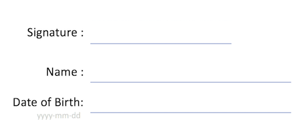

```{r setup, include=FALSE}
knitr::opts_chunk$set(echo = FALSE)
#get qrcode package
require(qrcode)

```

## Background

Before you decide whether to take part it is important for you to understand why the research is being done and what the study involves. If something is not clear or you would like more information, please ask  

###What is fever?  
Lorem ipsum dolor sit amet, consectetur adipiscing elit, sed do eiusmod tempor incididunt ut labore et dolore magna aliqua. Ut enim ad minim veniam, quis nostrud exercitation ullamco laboris nisi ut aliquip ex ea commodo consequat. Duis aute irure dolor in reprehenderit in voluptate velit esse cillum dolore eu fugiat nulla pariatur. Excepteur sint occaecat cupidatat non proident, sunt in culpa qui officia deserunt mollit anim id est laborum.

###What is the study about?  
Lorem ipsum dolor sit amet, consectetur adipiscing elit, sed do eiusmod tempor incididunt ut labore et dolore magna aliqua. Ut enim ad minim veniam, quis nostrud exercitation ullamco laboris nisi ut aliquip ex ea commodo consequat. Duis aute irure dolor in reprehenderit in voluptate velit esse cillum dolore eu fugiat nulla pariatur. Excepteur sint occaecat cupidatat non proident, sunt in culpa qui officia deserunt mollit anim id est laborum. \newline 

###Whose help do we need?  
Lorem ipsum dolor sit amet, consectetur adipiscing elit, sed do eiusmod tempor incididunt ut labore et dolore magna aliqua. Ut enim ad minim veniam, quis nostrud exercitation ullamco laboris nisi ut aliquip ex ea commodo consequat. Duis aute irure dolor in reprehenderit in voluptate velit esse cillum dolore eu fugiat nulla pariatur. Excepteur sint occaecat cupidatat non proident, sunt in culpa qui officia deserunt mollit anim id est laborum.  

###What does the study involve?  
Lorem ipsum dolor sit amet, consectetur adipiscing elit, sed do eiusmod tempor incididunt ut labore et dolore magna aliqua. Ut enim ad minim veniam, quis nostrud exercitation ullamco laboris nisi ut aliquip ex ea commodo consequat. Duis aute irure dolor in reprehenderit in voluptate velit esse cillum dolore eu fugiat nulla pariatur. Excepteur sint occaecat cupidatat non proident, sunt in culpa qui officia deserunt mollit anim id est laborum.  

###Who is doing this research?  
Lorem ipsum dolor sit amet, consectetur adipiscing elit, sed do eiusmod tempor incididunt ut labore et dolore magna aliqua. Ut enim ad minim veniam, quis nostrud exercitation ullamco laboris nisi ut aliquip ex ea commodo consequat. Duis aute irure dolor in reprehenderit in voluptate velit esse cillum dolore eu fugiat nulla pariatur. Excepteur sint occaecat cupidatat non proident, sunt in culpa qui officia deserunt mollit anim id est laborum.  

##THIS STUDY IS COMPLETELY CONFIDENTIAL: WE WILL NOT GIVE ANYONE ELSE ACCESS TO YOUR INFORMATION.  


#Subject

1.    I confirm that I have read, or had the information sheet for the FIEBRE study read to me and I fully understand it. I have had the chance to ask questions and they have been answered fully.          
\newline
2.    I understand that participation is voluntary and I am free to withdraw at any time without giving reason without my medical care being affected.             
\newline
3.    I agree to take part in the FIEBRE study.          
\newline


```{r cars, echo=FALSE,fig.height=2, fig.width=2}


#define maximum number of forms needed
nums<-1:10000

#add leading zeros
nums<-sprintf("%05d", nums)

#make full list of UIDs including ISO3166-1 alpha-2 country codes

MM<-paste("MM",nums,sep="")
MZ<-paste("MZ",nums,sep="")
ZW<-paste("ZW",nums,sep="")
MW<-paste("MW",nums,sep="")
LA<-paste("LA",nums,sep="")

```

# Consent `r MM[1]`

```{r consent, echo=F,fig.height=2, fig.width=2}
qrcode_gen(dataString = MM[1])

```
 
